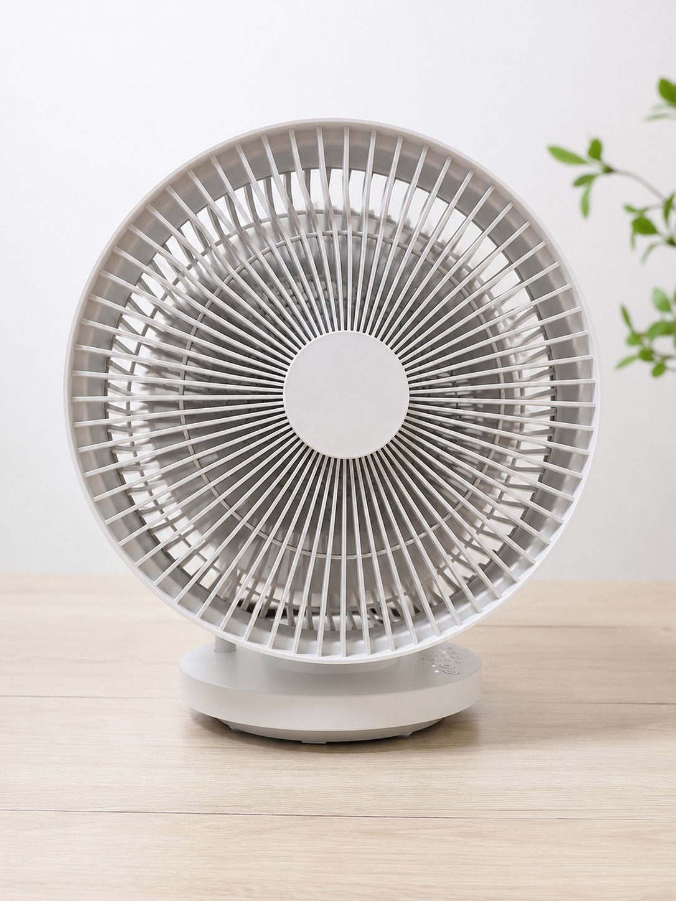
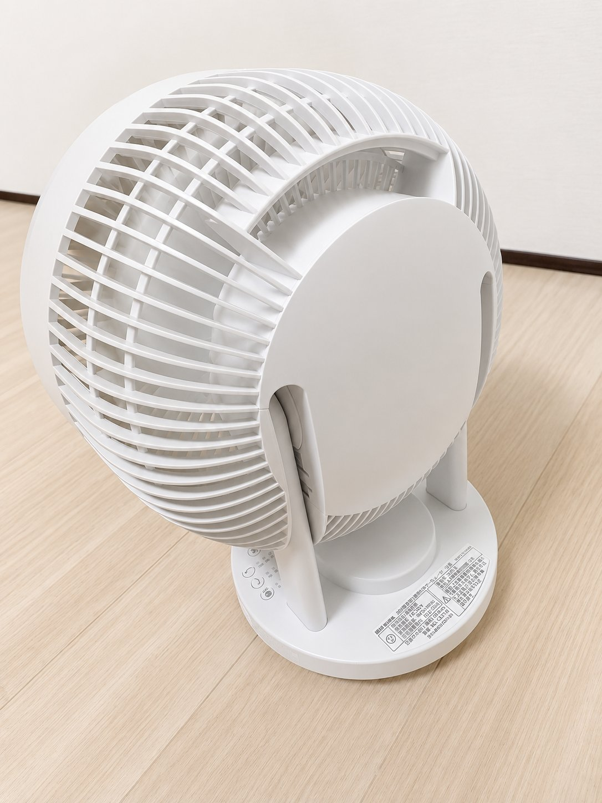
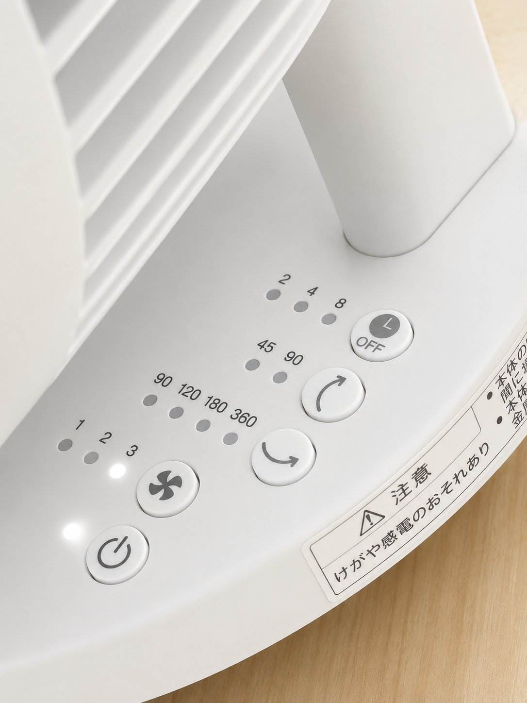

[以前の記事](/blog/2025-09-12-yukiguni-summer/)で「サーキュレーターのガラガラ音が気になってきた。そろそろ買い替えかな…」と書いていましたが、ついに買い替えました！

選んだのは、無印良品の**「360度首振り機能付きサーキュレーター18畳」（MJ-OCF18）**。

結論から言うと、**もっと早く買い替えればよかった**です（笑）
ガラガラ音に耐えていた日々はなんだったのか…。今回は、選んだ理由と実際に使ってみた本音をレポートします。

## １．買い替えを決めた理由

わが家のサーキュレーターは、風が直線的で「空気をかき混ぜる道具」としては優秀でした。
洗濯物の乾燥や、外の涼しい空気を取り込むのには欠かせない存在。

でも、年々**ガラガラという音が大きくなり**、テレビの音が聞こえにくいほどに。
「まだ動くから」と使い続けていましたが、音のストレスは毎日じわじわ効いてきます。
今年の夏を迎える前に、思い切って買い替えることにしました。

## ２．無印良品を選んだ決め手

家電量販店やネットでいろいろ見比べましたが、最終的に無印に決めたポイントは4つです。

- **静かさ** — 前の機種の反省から、今回は「音」を最優先に

- **デザイン** — 白くてシンプル。部屋に置いても圧迫感がない

- **手入れのしやすさ** — 前面ガードが外せて、羽根まで掃除しやすい構造

- **店舗で実物を確認できた** — 実際に音を聞いて、大きさを見て選べた安心感

特に大きかったのは、**店舗で実物を見られたこと**。
ネットのレビューだけではわからない「音の質」や「サイズ感」を自分の耳と目で確かめられたのは、無印ならではだと思います。

## ３．使ってみた感想：静かさに拍子抜け

家に持ち帰って電源を入れた瞬間、**「え、動いてる…？」と確認したくなるほど静か**でした。
あのガラガラ音と比べたら、まさに別世界です。

そして想像以上に良かったのが**360度首振り機能**。
左右だけでなく上下にも回って、部屋の空気を立体的にかき混ぜてくれます。
初めて動きを見たときは、ちょっと感動しました。首がぐるんと回る様子は、見ていて面白いです（笑）

わが家での使い方は主に2つ。
**外の涼しい空気を部屋に取り込む**ときと、**洗濯物に直接風を当てて早く乾かす**とき。
前の機種の仕事をしっかり引き継ぎつつ、静かになったぶん、つけていることを忘れるくらい暮らしに馴染んでいます。

## ４．気になる点も正直に

満足度は高いのですが、あえて言うなら**リモコンがないこと**。

ON・OFFのたびに本体まで行かなければならないのは、地味に面倒です。
そして360度首振りの角度調整も、**理想の角度にするにはボタンを何度も押す必要があります**。
「あとちょっと右…行きすぎた…」と、本体の前でボタンを連打する私です（笑）

シンプルさが無印の良さでもあるので、このあたりは割り切りかなと思っています。

## 電気代はどのくらい？

つけっぱなしにすることが多い家電なので、電気代も調べてみました。

MJ-OCF18は省エネなDCモーター搭載で、消費電力は弱7W・中11W・強15Wほど。電気料金の目安単価（31円/kWh）で計算すると、**1時間あたり約0.2〜0.5円**です。毎日8時間つけっぱなしにしても、ひと月で100円前後です。

そして雪国の私が期待しているのは、むしろ**冬の活躍**。暖房の暖かい空気は天井にたまりがちですが、サーキュレーターで循環させれば部屋全体が効率よく暖まります。**灯油代が上がり続けるなか**、1時間1円もかからないサーキュレーターで暖房効率を上げられるなら、冬の光熱費の節約にもつながりそうです。

## ５．こんな人におすすめ

- サーキュレーターの**音にストレス**を感じている方

- エアコンの冷気を**部屋全体に循環**させたい方

- シンプルなデザインの家電が好きな方

- 掃除やお手入れをラクに済ませたい方

価格は**税込6,990円**。首振りなしのタイプより少し高めですが、360度首振りの働きぶりを見ると、私は出す価値があったと思っています。

<!-- START MoshimoAffiliateEasyLink -->

リンク

<!-- MoshimoAffiliateEasyLink END -->

## ６．まとめ：音のストレスから解放されました

「まだ動くから」と古い家電を使い続けるのは、雪国育ちの性分かもしれません。
でも、毎日使うものだからこそ、**小さなストレスの積み重ねは意外と大きい**。

買い替えてみて、静かな部屋で扇風機の風の奪い合いをする日常が、少しだけ快適になりました（笑）

雪国の夏の暑さ対策については、こちらの記事もどうぞ。

[扇風機？エアコン？雪国の暑さ対策リアルレポ](/blog/2025-09-12-yukiguni-summer/)
